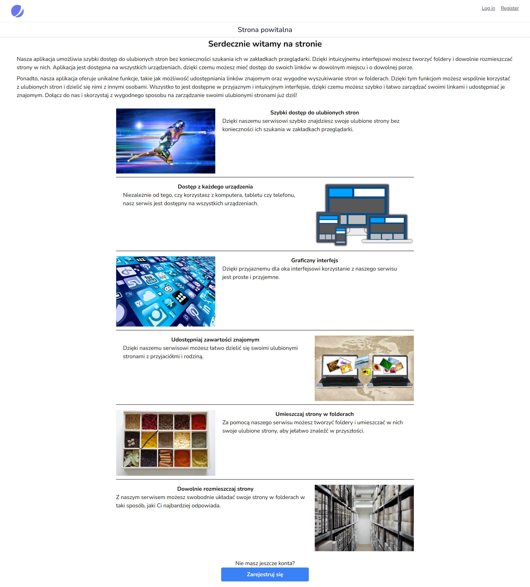

# Bookmarks
It is a system that allows you to share multiple links with a single link.

## Build with
1. LARAVEl 8
2. BOOTSTRAP 5

## Features
1. Adding categories, subcategories and pages
2. Sorting items
3. Change the status of items
4. Changing the parent for subcategories and pages
5. Access to public content without logging in

## Installation Instructions
1. Run `git clone https://github.com/dawidbros1/bookmarks-laravel`
2. Run `composer install` and `npm-install`
3. Create database for the project 
4. Run `copy .env.example .env`
5. Configure your `.env` file 
6. Run `php artisan migrate`
7. Run `php artisan serve`

## Table of contents
- [Screenshots](#screenshots)
- [Commands](#commands)

## Screenshots
<kbd>

</kbd>

## Commands
* `php artisan db:seed`: The command runs all seeders
* `php artisan db:seed --class=UserSeeder`: The command run user seeder
* `php artisan db:seed --class=CategorySeeder`: The command run category seeder
* `php artisan db:seed --class=SubcategorySeeder`: The command run subcategory seeder
* `php artisan db:seed --class=PageSeeder`: The command run page seeder
